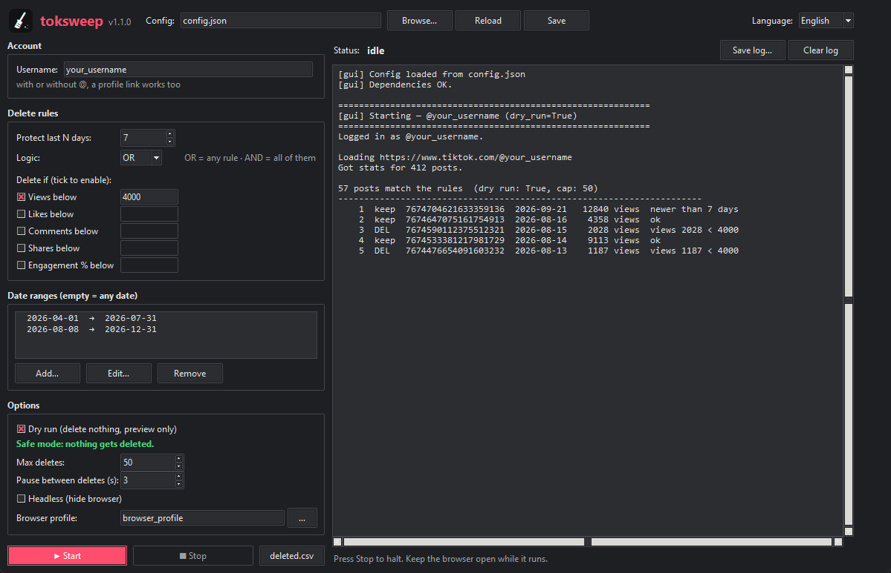

<p align="center">
  
</p>

<h1 align="center">toksweep</h1>

<p align="center">
  Bulk-delete the TikToks that didn't make it.<br>
  Pick a view threshold and a date range, hit run, go make a coffee.
</p>

<p align="center">
  <a href="https://buymeacoffee.com/dr_gaussx"></a>
  
  
</p>

---

TikTok has no bulk delete. If you post a lot, you end up with hundreds of videos sitting at
800 views dragging your profile down, and removing them by hand means *open, ..., delete,
confirm* a few hundred times.

toksweep does that clicking for you. It reads the real stats of every post on your profile,
decides which ones go based on your rules, and deletes them through the normal TikTok web UI,
one by one.

<p align="center">
  
</p>

## What it does

- Reads views, likes, comments, shares and post date for every post on your profile
  (straight from the data TikTok's own page loads, so the numbers are exact, not "1.2K")
- Deletes posts that match your rules:
  - views / likes / comments / shares below a threshold
  - engagement rate below a threshold
  - combine them with `OR` or `AND`
  - only inside the date ranges you choose
- Always leaves your most recent posts alone (last 7 days by default)
- Handles both videos and photo carousels
- **Dry run by default**: shows what it would delete and touches nothing
- Writes every deletion to `deleted.csv`, so you know exactly what's gone
- Emergency stop at any moment
- Checks you're logged in **as the account in the config** before touching anything
- Desktop app in English and Italian, light and dark theme, date picker. Or plain command line

## Quick start (Windows app)

1. Download `toksweep.exe` from the [latest release](https://github.com/XSparter/toksweep/releases/latest).
2. Put it in a folder of its own (it keeps its config, browser session and `deleted.csv` next to itself)
   and double-click it.
3. The first launch downloads the Chromium browser it drives (~150 MB, once).
4. Type your username, set your rules, leave **Dry run** ticked and press **Start**.
   A browser window opens: log into TikTok there the first time.
5. Read the preview in the log. When you're happy with it, untick Dry run and run again.

Windows SmartScreen may warn you because the exe isn't signed. Click *More info → Run anyway*,
or build it yourself from source (see [Building the exe](#building-the-exe)).

## Requirements (from source)

- Python 3.10 or newer
- Windows, macOS or Linux (the `q` stop key is Windows only; the `STOP` file works everywhere)
- A TikTok account you can log into from a browser

## Install

```bash
git clone https://github.com/XSparter/toksweep.git
cd toksweep
pip install -r requirements.txt
playwright install chromium
```

The desktop app does the last two steps by itself: on startup it checks for missing Python
packages and for the Chromium browser, and installs whatever is missing. You can also run
the check alone with `python deps.py`.

## The desktop app

```bash
python gui.py                  # uses config.json
python gui.py other.json       # or any other config file
```

- **Language**: English or Italian, picked from your Windows language; switch it from the
  menu in the top right. The choice is remembered in `gui_settings.json`.
- **Colors** follow the Windows light/dark setting, live, even while the app is open.
- **Date ranges** are picked from a calendar. Double-click a range to edit it.
- **Username** can be written as `name`, `@name` or pasted as a profile link
  (`https://www.tiktok.com/@name`): it's cleaned up automatically.
- **Start** saves the form to the config file and runs. With dry run off it asks for
  confirmation first. **Stop** finishes the current step and quits cleanly.
- `toksweep.exe --selftest` (or `python gui.py --selftest`) checks dependencies, the date
  picker and the browser, and writes the result to `selftest.txt`. Attach it to bug reports.

The app window has a fixed size on purpose, so the layout never breaks.

## Configure

The app edits the config for you. If you use the command line, copy the example config and edit it:

```bash
cp config.example.json config.json
```

```jsonc
{
  "account": { "username": "your_tiktok_username" },   // with or without @, or the profile link
  "rules": {
    "date_ranges": [                          // only posts published inside these ranges are considered
      { "from": "2026-04-01", "to": "2026-07-31" },
      { "from": "2026-08-08", "to": "2026-12-31" }
    ],                                        // empty list = any date
    "min_age_days": 7,                        // never touch posts younger than this
    "delete_if": {
      "views_below": 4000,                    // null = rule off
      "likes_below": null,
      "comments_below": null,
      "shares_below": null,
      "engagement_rate_below": null           // (likes + comments + shares) / views, in %
    },
    "logic": "OR"                             // OR: any rule matches. AND: all active rules must match
  },
  "options": {
    "dry_run": true,                          // set to false when you're happy with the preview
    "max_deletes_per_run": 50,
    "delay_between_deletes_seconds": 3,
    "headless": false,
    "locale": "en-US",
    "browser_profile_dir": "browser_profile"
  }
}
```

Dates use your computer's local time, so a video posted at 1 AM counts for that day.

## Run (command line)

```bash
python main.py                 # uses config.json
python main.py other.json      # or any other config file
```

The first time, a Chromium window opens on TikTok: log in normally. The session is kept in
`browser_profile/`, so you won't have to log in again next time.

### Login check

Before reading a single stat, toksweep asks TikTok which account the browser is logged into
and compares it with the username in the config:

- **not logged in**: it waits up to 5 minutes for you to log in from the browser window
  (Stop works while it waits). In headless mode you can't see the browser, so it stops
  right away and tells you to run once with headless off.
- **logged in as someone else**: it stops without touching anything. TikTok only lets you
  delete your own posts, and a wrong account means the rules were meant for another profile.
- **logged in as the right account**: it prints `Logged in as @you.` and carries on.

Start with `"dry_run": true`, read the list it prints, and only then switch it to `false`.

> **Keep the browser window in the foreground while it works.**
> TikTok slows down or pauses pages that are minimized or hidden behind other windows.
> When that happens the player stops responding and the run stalls. Let it sit on top
> and don't click around in it.

### Stopping it

- press `q` in the terminal (Windows), or
- create an empty file called `STOP` in the project folder

It finishes the current step and quits cleanly. Nothing gets left half deleted.

## Output

Every post gets one line while it runs:

```
   146  DEL   7674704621633359136  2026-08-16      2028 views     18 likes  views 2028 < 4000
          deleted (30/244)
   147  keep  7674647075161754913  2026-08-16      4358 views     39 likes  ok
```

Deleted posts are appended to `deleted.csv`:

```
deleted_at,id,posted,views,likes,comments,reason
2026-10-01T11:28:23,7688422714796870944,2026-09-22,1123,11,1,views 1123 < 4000
```

If something goes wrong, a screenshot goes into `debug/`.

## How it works

Short version: it uses your profile the way you would, just faster.

1. Opens your profile and scrolls the grid to the end. While doing that it listens to the
   responses TikTok's page already requests (`/api/post/item_list/`), which contain the
   exact stats and creation time of every post.
2. Opens the first post **from the grid**. That puts TikTok in "cinema mode", which is the
   only view where the *Delete* option shows up reliably. Opening a video URL directly
   gives you a different page with no delete button.
3. Moves down with the player's *next* arrow, checks each post against your rules, and when
   one has to go: `...` menu → *Delete* → confirm. Then it waits for TikTok's answer to the
   delete request and only counts it if TikTok says it worked.
4. Before every delete it double-checks that the player is showing the exact post it just
   judged, on your own account. If anything looks off, it skips.

It never calls TikTok's delete endpoint by itself. Those requests are signed inside the
browser, so the tool just clicks and lets TikTok do the rest.

More detail in [docs/how-it-works.md](docs/how-it-works.md).

## Heads up

- **Deleting is permanent.** TikTok has no trash bin. Use the dry run.
- **Promoted posts can't be deleted** while the promotion is running. TikTok refuses with
  *"this action is disabled during advertising"*; toksweep reports it and moves on.
- This automates your own account through the regular website. It's still automation:
  use reasonable delays and don't run it 24/7. You're responsible for how you use it.
- TikTok changes its web UI now and then. If a run starts failing, check `debug/` and
  open an issue with the screenshot.
- Not affiliated with TikTok or ByteDance.

## Building the exe

```bash
pip install -r requirements.txt
python build.py
```

That produces `dist/toksweep.exe`: a single file with Python, the app, Playwright and its
driver inside (~60 MB). Chromium isn't bundled; the exe downloads it to the standard
Playwright cache (`%LOCALAPPDATA%\ms-playwright`) the first time it starts. Run
`dist\toksweep.exe --selftest` to check the build.

## Project layout

| file | what it is |
|------|------------|
| `gui.py` | desktop app (tkinter): form, log, language and theme |
| `main.py` | command-line entry point |
| `sweeper.py` | the actual work: login check, stats, rules, navigation, deletes |
| `deps.py` | finds and installs missing packages and the Chromium browser |
| `build.py` | builds the Windows exe with PyInstaller |
| `config.example.json` | example config |
| `docs/how-it-works.md` | selectors, endpoints and the gotchas behind them |
| `tools/request-logger.user.js` | userscript to watch TikTok's web requests |

## Extra: request logger

`tools/request-logger.user.js` is the Tampermonkey script used to figure out how the
TikTok web app talks to its backend. It logs fetch/XHR calls to the console and lets you
copy them as JSON. Handy if TikTok changes something and you want to see what.

## Support

If toksweep saved you an afternoon of clicking, you can buy me a coffee:

<a href="https://buymeacoffee.com/dr_gaussx"></a>

## License

[MIT](LICENSE) © dr_gaussx.
You can use, change and redistribute it freely, as long as you keep the copyright notice
and credit the original project.
